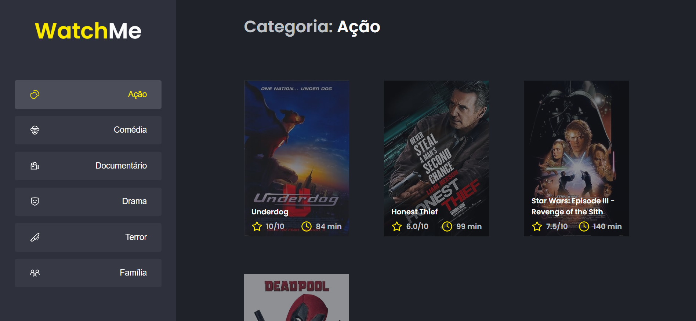

<h1 align="center">
  
</h1>

<h3 align="center">
  Desafio: Componentizando a aplicação
</h3>

<p align="center">Aplicação para listagem de filmes de acordo com o gênero</p>

<p align="center">
  <a href="#como-executar-o-projeto">Como executar o projeto</a>&nbsp;&nbsp;&nbsp;|&nbsp;&nbsp;&nbsp;
  <a href="#sobre-o-desafio">Sobre o Desafio</a>
</p>

<p align="center">Front-end</p>

<p align="center">
  
</p>

## Como executar o projeto

### Clonar este repositório

```bash
git clone https://github.com/eliasmcastro/rocketseat-ignite-reactjs-desafio-componentizando-a-aplicacao.git
```

### Requisitos

- [Node.js](https://nodejs.org) na versão 20.16.0
- [Yarn](https://yarnpkg.com) na versão 1.22.5

### Passos para a execução

**1. Executar aplicação**

Instalar as dependências do projeto

```bash
yarn
```

Iniciar a Fake API

```bash
yarn server
```

A Fake API começará a ser executado em http://localhost:3333

Iniciar o servidor de desenvolvimento

```bash
yarn dev
```

A aplicação começará a ser executada em http://localhost:8080

**2. Executar testes unitários**

Para executar os testes unitários

```bash
yarn test
```

## Sobre o desafio

A aplicação já está totalmente funcional mas grande parte do seu código está diretamente no arquivo `App.tsx`. Para resolver isso da melhor forma, é necessário dividir a aplicação em **pelo menos** duas partes principais: sidebar e o conteúdo principal que possui o header e a listagem de filmes.

- A aplicação possui apenas uma funcionalidade principal que é a listagem de filmes;
- Na sidebar é possível selecionar qual categoria de filmes deve ser listada;
- A primeira categoria da lista (que é "Ação") já deve começar como marcada;
- O header da aplicação possui apenas o nome da categoria selecionada que deve mudar dinamicamente.

### O que devo editar na aplicação

- src/App.tsx: Esse componente contém toda a aplicação com exceção do componente Button que não precisa ser alterado e Icon que também não precisa de alteração.

- src/components/Content.tsx: Esse componente, ainda vazio, deve possuir toda a lógica e corpo responsável pelo header e conteúdo.

- src/components/SideBar.tsx: Esse componente, também vazio, deve possuir toda a lógica e corpo responsável pela seção que contém o título do site e a parte de navegação à esquerda da página.